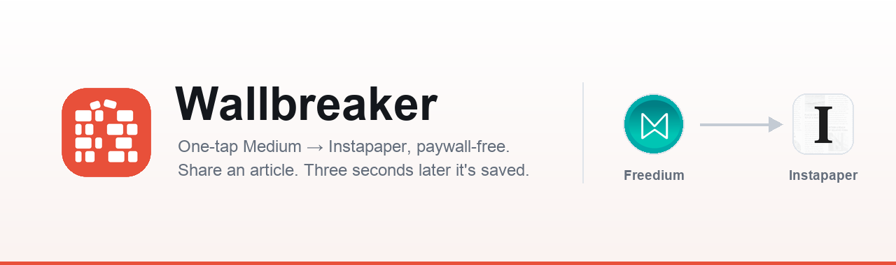
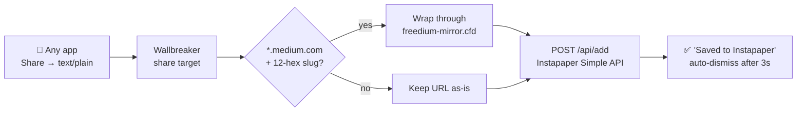

<div align="center">



<br><br>

[](https://developer.android.com)
[](https://kotlinlang.org)
[](https://developer.android.com/jetpack/compose)
[](https://apilevels.com)
[](https://apilevels.com)
<br>
[](#-build--test)
[](app/build.gradle.kts)
[](https://www.instapaper.com/developers/v1/simple-api)
[](https://freedium-mirror.cfd)

**Share a Medium article. Three seconds later it's in Instapaper — paywall stripped.**

</div>

---

## 🧱 Why

Saving a paywalled Medium article to Instapaper on Android was a seven-tap ritual. Wallbreaker collapses it to two.

| | Flow |
|---|---|
| **Before** | Medium → Share → unlock app → ⋮ → Open in browser → tap URL bar → Share → Instapaper |
| **After** | Medium → Share → **Save to Instapaper** ✅ |

No app to switch to, no browser detour, no clipboard. A small card confirms the save and disappears on its own, dropping you back exactly where you were reading.

## ⚡ How it works



Wrapping is **gated**, not blanket: Freedium only unlocks Medium articles, so anything else is saved untouched rather than turned into a broken link. That makes Wallbreaker a decent general-purpose Instapaper quick-saver too.

## ✨ Features

- **Two taps, zero context switch** — a translucent overlay, not a full screen. The app behind it stays visible.
- **Paywall-free** — Medium articles are routed through the Freedium mirror before saving.
- **Survives early dismissal** — the network call runs in an app-scoped coroutine. Tap the card away or let the screen sleep; the save still completes.
- **Credentials in the Android Keystore** — AES-GCM, hardware-backed (StrongBox where available).
- **No notification permission** — deliberately an `Activity`, not a notification. `INTERNET` is the only permission.
- **Mirror-resilient** — the Freedium base is a configurable fallback chain, because `.cfd` hosts come and go.

## 📲 Install

```bash
git clone https://github.com/gouthamganesan/wallbreaker.git
cd wallbreaker
./gradlew :app:installRelease     # builds + installs on a connected device
```

The release build is signed with the local debug keystore — a **non-debuggable** binary with no signing ceremony, which is exactly the security property that matters here (see [Design notes](#-design-notes)).

## 🔐 Configure

Open **Wallbreaker** from the launcher. One screen, one job:

| Field | Notes |
|---|---|
| **Email** | Your Instapaper account email |
| **Password** | Stored encrypted; an empty password is valid (many Instapaper accounts have none) |
| **Verify** | Calls `/api/authenticate` and reports whether the saved credentials actually work |

Credentials never leave the device except as the Simple API request body over TLS.

## 🛠 Build & test

No system Gradle needed — the wrapper handles it. Requires the Android SDK and a JDK 17+ (builds on 21).

```bash
# If no JDK is on PATH, point at Android Studio's bundled one:
export JAVA_HOME="/Applications/Android Studio.app/Contents/jbr/Contents/Home"

./gradlew :app:testDebugUnitTest    # 14 unit tests: URL extraction + Freedium gate
./gradlew :app:installRelease       # build + install
```

Fire the share target directly, no share sheet required:

```bash
adb shell am start -n dev.goutham.wallbreaker/.ShareActivity \
  -a android.intent.action.SEND -t text/plain \
  --es android.intent.extra.TEXT "https://medium.com/@author/some-post-1a2b3c4d5e6f"
```

Maestro flows for the credential setup and the auto-dismiss assertion live in [`.maestro/`](.maestro).

## 🗂 Architecture

Nine source files, two activities, no DI framework, four dependencies.

| File | Role |
|---|---|
| [`ShareActivity.kt`](app/src/main/java/dev/goutham/wallbreaker/ShareActivity.kt) | Translucent share target; reads `EXTRA_TEXT` |
| [`OverlayScreen.kt`](app/src/main/java/dev/goutham/wallbreaker/OverlayScreen.kt) | The Saving → Saved card and its 3-second auto-dismiss |
| [`SaveViewModel.kt`](app/src/main/java/dev/goutham/wallbreaker/SaveViewModel.kt) | App-scoped save so it outlives the overlay |
| [`Freedium.kt`](app/src/main/java/dev/goutham/wallbreaker/Freedium.kt) | Mirror fallback chain, Medium gate, wrapping rule |
| [`InstapaperClient.kt`](app/src/main/java/dev/goutham/wallbreaker/InstapaperClient.kt) | Simple API — `add` + `authenticate` |
| [`CredentialStore.kt`](app/src/main/java/dev/goutham/wallbreaker/CredentialStore.kt) | Keystore AES-GCM credential storage |
| [`UrlExtractor.kt`](app/src/main/java/dev/goutham/wallbreaker/UrlExtractor.kt) | Pulls the first URL out of shared text |
| [`ConfigScreen.kt`](app/src/main/java/dev/goutham/wallbreaker/ConfigScreen.kt) | The one-screen config |

## 🧠 Design notes

<details>
<summary><b>What the Keystore actually protects — and what it doesn't</b></summary>

<br>

The Simple API needs the plaintext password at request time, so storage must be reversible — no hashing. The password is encrypted with an AES-GCM key generated **inside** the Android Keystore; the key material never enters app memory.

**Protects:** the ciphertext on disk is useless *off-device*. A stolen locked phone, a pulled data partition, a leaked backup — all yield ciphertext and no key. `allowBackup="false"` keeps it out of cloud/device-transfer backups entirely.

**Does not protect:** anything executing *as the app* — root, instrumentation, or a debuggable build (`adb run-as`). The Keystore is a vault whose door your own app opens on demand. That's why the daily-driver build is the non-debuggable release; `adb run-as` is refused against it.

**The actual weakest link** isn't storage at all — the Simple API transmits the password in the body of every request. TLS plus never logging request bodies is the whole mitigation, and there's nothing else to be done about it short of the OAuth Full API.

`setUserAuthenticationRequired(false)` is deliberate: a biometric prompt inside a two-tap flow would destroy the product it's protecting.

</details>

<details>
<summary><b>Why a translucent Activity instead of a notification</b></summary>

<br>

A notification would need `POST_NOTIFICATIONS` (runtime permission on Android 13+), a channel, and would leave a dismissible artifact behind. A translucent `Activity` with `taskAffinity=""` and `excludeFromRecents="true"` lives in a throwaway task — `finish()` returns you precisely where you were, and the only permission the app declares is `INTERNET`.

</details>

<details>
<summary><b>Why the Freedium base is a list, not a string</b></summary>

<br>

`.cfd` hosts are volatile. The original `freedium.cfd` stopped resolving entirely; the live mirror is `freedium-mirror.cfd`. `Freedium.BASES` is an ordered fallback chain whose head is the active mirror — when one dies, promote another. Hardcoding a single host is how this app silently breaks.

The wrapping rule itself is deliberately dumb: `base + "/" + rawURL`, scheme kept, inner URL *not* percent-encoded (form-encoding happens later, in the HTTP client — a separate concern).

</details>

<details>
<summary><b>Why HttpURLConnection instead of Retrofit/OkHttp</b></summary>

<br>

Two endpoints, one content type, form-encoded bodies. On Android `HttpURLConnection` is backed by OkHttp internally anyway. The entire client is ~60 lines you can read in one screen — when a dependency's surface area exceeds the problem's, building is the conservative choice.

</details>

## ⚠️ Known behaviour

- **Dedupe is on the wrapped URL.** A Freedium-wrapped save and a raw save of the same article are two different URL strings, so Instapaper treats them as two bookmarks.
- **Non-Medium links are saved unwrapped** — by design; Freedium can't unlock them.
- **Medium non-articles** (profiles, tag pages) have no 12-hex post id, so they're saved raw rather than wrapped.
- Re-saving the same URL isn't an error — Instapaper bumps it to the top instead of duplicating.

## 🙏 Credits

- [**Freedium**](https://freedium-mirror.cfd) — the mirror that does the actual unlocking.
- [**Instapaper**](https://www.instapaper.com) and its refreshingly simple [Simple API](https://www.instapaper.com/developers/v1/simple-api).

Logos belong to their respective owners and are used here to identify the services this app talks to. Wallbreaker is an unaffiliated personal utility.
