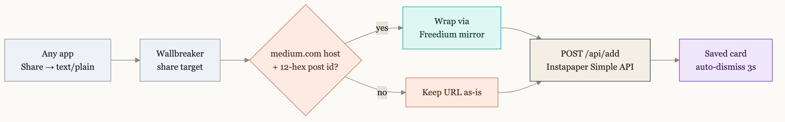

<div align="center">


<br><br>

[](https://developer.android.com)
[](https://kotlinlang.org)
[](https://developer.android.com/jetpack/compose)
[](https://apilevels.com)
[](https://apilevels.com)
<br>
[](LICENSE)
[](#-build--test)
[](app/build.gradle.kts)
[](https://www.instapaper.com/developers/v1/full-api)
[](https://freedium-mirror.cfd)

**Share a Medium article. Three seconds later it's in Instapaper — paywall stripped, link unchanged.**

<br>

[](https://github.com/gouthamganesan/wallbreaker/releases/latest/download/wallbreaker.apk)

*A direct sideload, not a Play Store listing — Android will ask you to confirm "install from unknown sources" once. It's a personal, debug-signed build; see [Build & test](#-build--test) to build it yourself instead.*

</div>

---

## 🧱 Why

Saving a paywalled Medium article to Instapaper on Android was a seven-tap ritual. Wallbreaker collapses it to two.

| | Flow |
|---|---|
| **Before** | Medium → Share → unlock app → ⋮ → Open in browser → tap URL bar → Share → Instapaper |
| **After** | Medium → Share → **Save to Instapaper** ✅ |

No app to switch to, no browser detour, no clipboard. A small card confirms the save and disappears on its own, dropping you back exactly where you were reading.

## ⚡ How it works



Wrapping is **gated**, not blanket: Freedium only unlocks Medium articles, so anything else is saved untouched rather than turned into a broken link. That makes Wallbreaker a decent general-purpose Instapaper quick-saver too.

## ✨ Features

- **Two taps, zero context switch** — a translucent overlay, not a full screen. The app behind it stays visible.
- **Paywall-free, link unchanged** — with an Instapaper API app configured, Wallbreaker fetches the unlocked Freedium render server-side and uploads the article text directly, so the saved bookmark keeps the clean original URL instead of a mirror link.
- **Raw HTML files, too** — Wallbreaker is also a share target for `.html`/`text/html` shares; it extracts the canonical URL and title and uploads the content as-is.
- **Local-first, like the real Instapaper app** — the save lands in on-device history instantly; a WorkManager job delivers it in the background with retry, so a dead connection never blocks the "Saved" moment.
- **A real history, not just a toast** — opening the app shows every save with its route (plain link / Freedium-unlocked / full-text upload) and live sync status.
- **User-editable routing** — paste a link in Settings and its domain joins the Freedium allowlist; defaults match the known Medium-family publications (`medium.com`, `uxdesign.cc`, `infosecwriteups.com`, …).
- **Survives early dismissal** — every save runs in an app-scoped coroutine / WorkManager job. Tap the card away or let the screen sleep; it still completes.
- **Credentials in the Android Keystore** — AES-GCM, hardware-backed (StrongBox where available). Password, OAuth consumer keys, and the cached OAuth token are all encrypted the same way.
- **No notification permission** — the share confirmation is a translucent `Activity`, not a notification. `INTERNET` is the only permission.
- **Mirror-resilient** — the Freedium base is a configurable fallback chain, because `.cfd` hosts come and go.

## 📲 Install

**Just want the app?**

[](https://github.com/gouthamganesan/wallbreaker/releases/latest/download/wallbreaker.apk)

Download, open it, and approve the "install from unknown sources" prompt — that's Android's standard warning for any app outside the Play Store, not a sign of anything wrong. Every release is built from this repo's source.

**Building it yourself:**

```bash
git clone https://github.com/gouthamganesan/wallbreaker.git
cd wallbreaker
./gradlew :app:installRelease     # builds + installs on a connected device
```

The release build is signed with the local debug keystore — a **non-debuggable** binary with no signing ceremony, which is exactly the security property that matters here (see [Design notes](#-design-notes)).

## 🔐 Configure

Open **Wallbreaker** from the launcher — it opens straight to your save history. Tap the gear for Settings:

| Section | Fields |
|---|---|
| **Instapaper account** | Email + password (Simple API — the only setup a plain-link saver needs) |
| **Full-text unlock** | Instapaper API consumer key + secret. Reuses the account above via a one-time OAuth exchange — enables the clean-URL full-text upload and raw HTML-file saving |
| **Freedium routing** | An editable domain allowlist; paste any link and its domain is extracted and added |
| **Advanced** | The Freedium mirror base URL, for when the `.cfd` host rotates |

Get a consumer key/secret from [Instapaper's developer page](https://www.instapaper.com/main/request_oauth_consumer_token) — new apps work immediately against your own account. Your password is exchanged for an OAuth token once and never stored in plaintext; everything at rest is Keystore-encrypted.

## 🛠 Build & test

No system Gradle needed — the wrapper handles it. Requires the Android SDK and a JDK 17+ (builds on 21).

```bash
# If no JDK is on PATH, point at Android Studio's bundled one:
export JAVA_HOME="/Applications/Android Studio.app/Contents/jbr/Contents/Home"

./gradlew :app:testDebugUnitTest    # 18 unit tests: OAuth signer, Freedium gate, URL extraction
./gradlew :app:installRelease       # build + install
```

Fire the share target directly, no share sheet required:

```bash
adb shell am start -n dev.goutham.wallbreaker/.ShareActivity \
  -a android.intent.action.SEND -t text/plain \
  --es android.intent.extra.TEXT "https://medium.com/@author/some-post-1a2b3c4d5e6f"
```

End-to-end UI flows (share a link, share an HTML file, edit Freedium routing, verify history) run via [Maestro](https://maestro.mobile.dev) — one command drives the whole suite, firing the share intents itself:

```bash
.maestro/run.sh
```

## 🗂 Architecture

27 source files, two activities, no DI framework, ten dependencies.

**Share flow**

| File | Role |
|---|---|
| [`ShareActivity.kt`](app/src/main/java/dev/goutham/wallbreaker/ShareActivity.kt) | Translucent share target; reads `EXTRA_TEXT` (links) or `EXTRA_STREAM` (HTML files) |
| [`OverlayScreen.kt`](app/src/main/java/dev/goutham/wallbreaker/OverlayScreen.kt) | The Saving → Saved card, its 3-second auto-dismiss, and the crack-draw mark animation |
| [`SaveViewModel.kt`](app/src/main/java/dev/goutham/wallbreaker/SaveViewModel.kt) | Turns a share into a payload and hands it to the router — local-first, so this never blocks on the network |
| [`SendRouter.kt`](app/src/main/java/dev/goutham/wallbreaker/SendRouter.kt) | Per-item routing: plain link, Freedium-wrapped link, fetch-and-upload, or raw-HTML upload |
| [`UrlExtractor.kt`](app/src/main/java/dev/goutham/wallbreaker/UrlExtractor.kt) | Pulls the first URL out of shared text; extracts a domain from pasted input |
| [`HtmlMeta.kt`](app/src/main/java/dev/goutham/wallbreaker/HtmlMeta.kt) | Canonical URL / title extraction from a shared HTML document (regex, no parser dependency) |
| [`Freedium.kt`](app/src/main/java/dev/goutham/wallbreaker/Freedium.kt) / [`FreediumFetcher.kt`](app/src/main/java/dev/goutham/wallbreaker/FreediumFetcher.kt) | Mirror fallback chain + wrapping rule; server-side fetch of the unlocked render |

**Instapaper clients**

| File | Role |
|---|---|
| [`InstapaperClient.kt`](app/src/main/java/dev/goutham/wallbreaker/InstapaperClient.kt) | Simple API — `add` + `authenticate` |
| [`InstapaperFullApi.kt`](app/src/main/java/dev/goutham/wallbreaker/InstapaperFullApi.kt) | Full API — xAuth, `verify_credentials`, `bookmarks/add` with uploaded `content` |
| [`oauth/OAuthSigner.kt`](app/src/main/java/dev/goutham/wallbreaker/oauth/OAuthSigner.kt) | Pure OAuth 1.0a HMAC-SHA1 signer — cross-verified against known-answer headers |
| [`FullApiAuth.kt`](app/src/main/java/dev/goutham/wallbreaker/FullApiAuth.kt) | Resolves/caches the OAuth token from stored consumer keys + account password |
| [`CredentialStore.kt`](app/src/main/java/dev/goutham/wallbreaker/CredentialStore.kt) | Keystore AES-GCM storage for the password, consumer keys, and cached OAuth token |
| [`AppSettings.kt`](app/src/main/java/dev/goutham/wallbreaker/AppSettings.kt) | Non-secret config: Freedium on/off, mirror base, domain allowlist |

**Local-first store**

| File | Role |
|---|---|
| [`db/`](app/src/main/java/dev/goutham/wallbreaker/db) | Room: one row per save, with route + live sync status |
| [`ShareRepository.kt`](app/src/main/java/dev/goutham/wallbreaker/ShareRepository.kt) | Insert-then-enqueue seam between the share flow, the worker, and the UI |
| [`SyncWorker.kt`](app/src/main/java/dev/goutham/wallbreaker/SyncWorker.kt) | Delivers a save in the background; retriable vs. terminal error mapping, exponential backoff |

**UI**

| File | Role |
|---|---|
| [`ui/HistoryScreen.kt`](app/src/main/java/dev/goutham/wallbreaker/ui/HistoryScreen.kt) | The save history — day-grouped, live status per row |
| [`ui/SettingsScreen.kt`](app/src/main/java/dev/goutham/wallbreaker/ui/SettingsScreen.kt) | Account, Full-text unlock, Freedium routing, Advanced |
| [`ui/WallMark.kt`](app/src/main/java/dev/goutham/wallbreaker/ui/WallMark.kt) | The Throughline mark + route glyph, drawn in Compose |
| [`ui/theme/`](app/src/main/java/dev/goutham/wallbreaker/ui/theme) | The "Brick & Paper" Material 3 theme — coral-seeded, dynamic color off |

## 🧠 Design notes

<details>
<summary><b>What the Keystore actually protects — and what it doesn't</b></summary>

<br>

The Simple API needs the plaintext password at request time, so storage must be reversible — no hashing. The password is encrypted with an AES-GCM key generated **inside** the Android Keystore; the key material never enters app memory.

**Protects:** the ciphertext on disk is useless *off-device*. A stolen locked phone, a pulled data partition, a leaked backup — all yield ciphertext and no key. `allowBackup="false"` keeps it out of cloud/device-transfer backups entirely.

**Does not protect:** anything executing *as the app* — root, instrumentation, or a debuggable build (`adb run-as`). The Keystore is a vault whose door your own app opens on demand. That's why the daily-driver build is the non-debuggable release; `adb run-as` is refused against it.

**The actual weakest link** isn't storage at all — the Simple API transmits the password in the body of every request. TLS plus never logging request bodies is the whole mitigation, and there's nothing else to be done about it short of the OAuth Full API.

`setUserAuthenticationRequired(false)` is deliberate: a biometric prompt inside a two-tap flow would destroy the product it's protecting.

</details>

<details>
<summary><b>Why a translucent Activity instead of a notification</b></summary>

<br>

A notification would need `POST_NOTIFICATIONS` (runtime permission on Android 13+), a channel, and would leave a dismissible artifact behind. A translucent `Activity` with `taskAffinity=""` and `excludeFromRecents="true"` lives in a throwaway task — `finish()` returns you precisely where you were, and the only permission the app declares is `INTERNET`.

</details>

<details>
<summary><b>Why the Freedium base is a list, not a string</b></summary>

<br>

`.cfd` hosts are volatile. The original `freedium.cfd` stopped resolving entirely; the live mirror is `freedium-mirror.cfd`. `Freedium.BASES` is an ordered fallback chain whose head is the active mirror — when one dies, promote another. Hardcoding a single host is how this app silently breaks.

The wrapping rule itself is deliberately dumb: `base + "/" + rawURL`, scheme kept, inner URL *not* percent-encoded (form-encoding happens later, in the HTTP client — a separate concern).

</details>

<details>
<summary><b>Why HttpURLConnection instead of Retrofit/OkHttp</b></summary>

<br>

Two endpoints, one content type, form-encoded bodies. On Android `HttpURLConnection` is backed by OkHttp internally anyway. The entire client is ~60 lines you can read in one screen — when a dependency's surface area exceeds the problem's, building is the conservative choice.

</details>

## ⚠️ Known behaviour

- **Dedupe is on the saved URL.** Without a Full API app configured, a Freedium-wrapped save and a raw save of the same article are two different URL strings, so Instapaper treats them as two bookmarks. With one configured, the full-text upload path saves under the *original* URL, so this doesn't come up.
- **Non-routed links are saved unwrapped** — by design; Freedium can't unlock a domain it doesn't recognise.
- **HTML files with no canonical/`og:url` meta tag** save under a synthetic `wallbreaker.local/doc-<hash>` placeholder URL rather than failing outright.
- Re-saving the same URL isn't an error — Instapaper bumps it to the top instead of duplicating.

## 🙏 Credits

- [**Freedium**](https://freedium-mirror.cfd) — the mirror that does the actual unlocking.
- [**Instapaper**](https://www.instapaper.com) and its refreshingly simple [Simple API](https://www.instapaper.com/developers/v1/simple-api).

Logos belong to their respective owners and are used here to identify the services this app talks to. Wallbreaker is an unaffiliated personal utility.

## 📄 License

[MIT](LICENSE) © Goutham Ganesan
